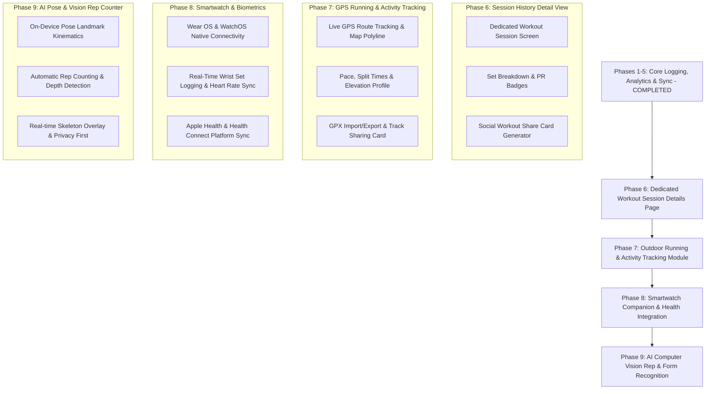

# Thews — Feature Roadmap & Implementation Phases

This document details the multi-phase implementation roadmap for **Thews**, including core features, upcoming wearable integrations, outdoor GPS tracking modules, AI vision capabilities, and detailed technical specifications.

---



---

## Active Roadmap & Upcoming Phases

### [x] Phase 6: Dedicated Workout Session History Details Page
* **Status:** Completed
* **Goal:** Create a dedicated, rich workout summary page (`/history/workout/:id`) providing complete analytical insight into past completed sessions.
* **UI & UX Specifications:**
  * Hero session metrics header: date/time, total duration, total working volume, total sets completed, and PR badge callouts.
  * Set-by-set table grouped by exercise with set type badges (`Warmup`, `Normal`, `Drop`, `Failure`) and performance metrics.
  * Interactive muscle group breakdown chart for the session.
  * Social Workout Share Card Generator (`workout_share_card.dart`) allowing users to generate and export an image card of their workout summary.
* **Database & Architecture Need:**
  * Add query `watchWorkoutSessionDetails(int workoutId)` in `app_database.dart` joining workout metadata, exercise definitions, set entries, and PR flags.
* **Key File Pointers:**
  * [`workout_session_detail_screen.dart`](file:///D:/androidProjects/Thews/lib/features/history/presentation/workout_session_detail_screen.dart)
  * [`workout_share_card.dart`](file:///D:/androidProjects/Thews/lib/features/history/presentation/widgets/workout_share_card.dart)
  * [`app_database.dart`](file:///D:/androidProjects/Thews/lib/core/database/app_database.dart)
  * [`app_router.dart`](file:///D:/androidProjects/Thews/lib/core/router/app_router.dart)

### [x] Phase 7: Outdoor Running & Activity Module with Live Tracking & Route Sharing (Strava-like)
* **Status:** Completed
* **Goal:** Full outdoor activity tracker for running, walking, and cycling with live GPS mapping, split calculations, elevation profile, GPX export/import, and graphic route sharing.
* **UI & UX Specifications:**
  * Live Map Screen with interactive vector polyline (`flutter_map` / OpenStreetMap / Mapbox tiles).
  * Real-time telemetry overlay: current pace (min/km), average pace, distance, duration, and elevation gain.
  * Auto-pause detection when stationary and voice/haptic split prompts every kilometer or mile.
  * Post-run summary view with pace graph, elevation curve, split table, and Strava-style map snapshot card for social sharing via `share_plus`.
  * Import and export workouts in standard `.gpx` file format.
* **Database Schema Expansion:**
  ```dart
  @DataClassName('RunActivityData')
  class RunActivities extends Table {
    IntColumn get id => integer().autoIncrement()();
    IntColumn get workoutId => integer().nullable().references(Workouts, #id, onDelete: KeyAction.cascade)();
    DateTimeColumn get startTime => dateTime()();
    RealColumn get distanceMeters => real()();
    IntColumn get durationSeconds => integer()();
    RealColumn get avgPaceSecondsPerKm => real()();
    RealColumn get elevationGainMeters => real().withDefault(const Constant(0.0))();
    TextColumn get gpxPolyline => text().nullable()(); // Encoded polyline or raw GPX JSON
  }
  ```
* **Dependencies:** `geolocator`, `flutter_map`, `latlong2`, `gpx`, `share_plus`.
* **Key File Pointers:**
  * `lib/features/running/presentation/run_tracker_screen.dart`
  * `lib/features/running/presentation/run_summary_screen.dart`
  * `lib/core/services/gps_tracking_service.dart`
  * `lib/core/utils/gpx_parser.dart`
  * [`tables.dart`](file:///D:/androidProjects/Thews/lib/core/database/tables.dart)

### Phase 8: Smartwatch Companion & Biometric Integration (Wear OS & Apple Watch)
* **Goal:** Seamless bi-directional wrist companion sync with Android Wear OS and Apple Watch OS for real-time heart rate monitoring, live set logging, rest timer vibration on wrist, and Health App data synchronization.
* **Technical Specifications:**
  * **Wear OS & WatchOS Native App Channel:** Implement native channels bridging Flutter to Kotlin (Wearable Data Layer API / Health Connect) and Swift (WatchConnectivity framework / HealthKit).
  * **Real-time Wrist Sync:**
    * Stream current exercise name, target reps/weight, and rest countdown timer directly to watch face.
    * Wrist interaction: complete sets, adjust weights/reps, and trigger rest timer directly from watch.
    * Stream live Heart Rate (BPM) and active calorie burn from watch biometrics into active workout session.
  * **Health Platform Sync:** Dual integration writing workouts and reading daily activity metrics from **Apple Health** (`HealthKit`) and **Android Health Connect**.
* **Dependencies:** `flutter_watch_connectivity` / native method channels, `health` / `health_connect`.
* **Key File Pointers:**
  * `lib/core/services/smartwatch_service.dart`
  * `lib/core/services/health_platform_service.dart`
  * `android/app/src/main/kotlin/.../WearableDataService.kt`
  * `ios/WatchApp/WatchConnectivityManager.swift`

### Phase 9: AI/ML Exercise Visual Rep Recognition & Form Analysis (Future Integration)
* **Goal:** Camera-assisted automatic rep counting and live biomechanical form guidance using real-time on-device pose landmark detection.
* **Technical Specifications:**
  * **Camera & ML Pipeline:** Process camera frame stream locally using `camera` and `google_mlkit_pose_detection` (or custom TFLite / MediaPipe pose landmarks).
  * **Kinematics Rep Counting Engine:**
    * Track key skeletal joint angles in real time (e.g. knee/hip angles for squats, elbow angle for bicep curls & bench press).
    * State machine algorithm tracking movement phases (setup → eccentric phase → inflection bottom → concentric phase → lockout completion) to increment set reps automatically.
  * **Visual Feedback & Privacy:**
    * Render real-time skeleton overlay on camera viewfinder with green/red joint alignment indicators.
    * 100% local on-device computation—no camera stream data leaves the user's phone.
* **Dependencies:** `google_mlkit_pose_detection`, `camera`, `tflite_flutter`.
* **Key File Pointers:**
  * `lib/features/ai_vision/presentation/camera_rep_counter_screen.dart`
  * `lib/features/ai_vision/domain/pose_detector_service.dart`
  * `lib/features/ai_vision/domain/kinematics_rep_calculator.dart`

---

## Completed Milestones (Phases 1–5)

- **Phase 1: Core Logging & In-Session UX**
  - Previous Session Ghost Data (Target Guidance)
  - Integrated Rest Timer Bar & Haptics
  - Form Keyboard Focus Traversal & Auto-Next Focus
  - Barbell Plate Calculator Helper Modal

- **Phase 2: DB Schema, Set Types & Routine Templates**
  - Set Types Migration (Warmup, Normal, Drop, Failure)
  - Routine Templates & Preset Launcher UI

- **Phase 3: Visual Analytics, PR Detection & Anatomy Map**
  - Interactive Progress Charts (`fl_chart`)
  - Muscle Heatmap & Volume Distribution
  - Automatic PR Detection & Toast Celebration
  - Interactive Body Anatomy Map

- **Phase 4: Data Management, Import/Export & System Integration**
  - Full JSON & CSV Data Backup / Import / Export
  - Active Workout Ongoing System Notifications
  - Remote Sync Provider Abstraction Layer

- **Phase 5: Quality Assurance & CI/CD Pipeline**
  - In-Memory Drift DB Unit Tests
  - GitHub Actions CI Workflow
