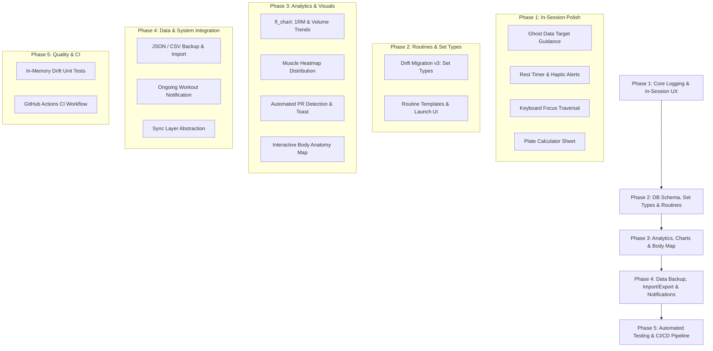

# Thews — Feature Roadmap & Implementation Phases

This document details the multi-phase implementation roadmap for **Thews**, with precise database schema changes, file pointers, technical specifications, and UX enhancements.

---



---

## Phase 1: Immediate UX & Core Workout Logging Polish

### 1.1 Previous Session Ghost Data (Target Guidance)
* **Goal:** Eliminate guesswork during workout logging by displaying the previous performance for each exercise right above or inside the set input row.
* **Schema/Query Need:** Query the latest `SetEntries` for an `exerciseId` from the most recent workout prior to the active workout session ID.
* **Key File Pointers:**
  * [`tables.dart`](file:///D:/androidProjects/Thews/lib/core/database/tables.dart)
  * [`app_database.dart`](file:///D:/androidProjects/Thews/lib/core/database/app_database.dart) — Add query `getPreviousExercisePerformance(int exerciseId, int currentWorkoutId)`
  * [`active_session_screen.dart`](file:///D:/androidProjects/Thews/lib/features/workouts/presentation/active_session_screen.dart) — Render ghost text (e.g. `Last: 80 kg × 8 reps`) above input fields.

### 1.2 Integrated Rest Timer Bar & Haptics
* **Goal:** Sticky countdown timer at the bottom/top of the screen triggered when a set checkbox is completed.
* **Implementation:**
  * Riverpod StateNotifier/Notifier for `RestTimerState` (seconds remaining, running, target duration).
  * Quick duration increment buttons (+30s, +1m).
  * Call `HapticFeedback.vibrate()` and system notification audio sound upon expiry.
* **Key File Pointers:**
  * `lib/features/workouts/presentation/rest_timer_provider.dart`
  * [`active_session_screen.dart`](file:///D:/androidProjects/Thews/lib/features/workouts/presentation/active_session_screen.dart)

### 1.3 Form Keyboard Focus Traversal & Auto-Next Focus
* **Goal:** Fast multi-set entry without tapping away from the soft keyboard.
* **Implementation:**
  * Attach `FocusNode`s to weight and reps input fields.
  * Set `textInputAction: TextInputAction.next` on the weight field to jump focus to the reps field automatically.
* **Key File Pointers:**
  * [`active_session_screen.dart`](file:///D:/androidProjects/Thews/lib/features/workouts/presentation/active_session_screen.dart)

### 1.4 Barbell Plate Calculator Helper Modal
* **Goal:** Visual bottom sheet that calculates exact weight plates required per side of a barbell.
* **Logic:** `(targetWeight - barWeight) / 2` mapped to plate denominations (25kg, 20kg, 15kg, 10kg, 5kg, 2.5kg, 1.25kg or equivalent lbs).
* **Key File Pointers:**
  * `lib/features/workouts/presentation/widgets/plate_calculator_sheet.dart`
  * [`active_session_screen.dart`](file:///D:/androidProjects/Thews/lib/features/workouts/presentation/active_session_screen.dart)

---

## Phase 2: Database Schema Expansion, Set Types & Routine Templates

### 2.1 Set Types Migration (Warmup, Working, Drop Set, Failure)
* **Goal:** Distinguish warm-up sets from working volume to keep volume analytics and PR tracking accurate.
* **Drift DB Migration (Version 2 → 3):**
  ```dart
  // In tables.dart (SetEntries table):
  TextColumn get type => text().withDefault(const Constant('normal'))(); // 'warmup' | 'normal' | 'drop' | 'failure'
  ```
* **Queries & Logic:**
  * Exclude `type == 'warmup'` from total working volume aggregation in `watchTotalVolume()`.
  * Display set type selector badge (W / Wk / D / F) next to set number in logging UI.
* **Key File Pointers:**
  * [`tables.dart`](file:///D:/androidProjects/Thews/lib/core/database/tables.dart)
  * [`app_database.dart`](file:///D:/androidProjects/Thews/lib/core/database/app_database.dart)
  * [`active_session_screen.dart`](file:///D:/androidProjects/Thews/lib/features/workouts/presentation/active_session_screen.dart)

### 2.2 Workout Routines & Templates
* **Goal:** Save preset workout routines (e.g. "Push Day A", "Upper Body Power") and launch a pre-populated active workout session in 1 tap.
* **Database Schema Additions:**
  * `Routines` table: `id`, `name`, `description`, `createdAt`
  * `RoutineExercises` table: `id`, `routineId`, `exerciseId`, `targetSets`, `targetReps`, `sortOrder`
* **UI Features:**
  * Routines tab/view under Workouts.
  * "Save Workout as Routine" button in History or Active Workout screen.
  * "Start Routine" launcher button on Dashboard.
* **Key File Pointers:**
  * [`tables.dart`](file:///D:/androidProjects/Thews/lib/core/database/tables.dart)
  * [`app_database.dart`](file:///D:/androidProjects/Thews/lib/core/database/app_database.dart)
  * `lib/features/workouts/presentation/routines_screen.dart`
  * `lib/features/workouts/presentation/routines_provider.dart`

---

## Phase 3: Visual Analytics, PR Detection & Anatomy Visualizer

### 3.1 Interactive Progress Charts (`fl_chart` Integration)
* **Goal:** Interactive charts showing progress per exercise over time.
* **Metrics:**
  1. **Estimated 1RM (Epley formula):** $$1RM = \text{weight} \times \left(1 + \frac{\text{reps}}{30}\right)$$
  2. **Max Weight Lifted**
  3. **Total Exercise Volume**
* **Dependencies:** Add `fl_chart: ^0.70.0` to [`pubspec.yaml`](file:///D:/androidProjects/Thews/pubspec.yaml).
* **Key File Pointers:**
  * [`pubspec.yaml`](file:///D:/androidProjects/Thews/pubspec.yaml)
  * [`exercise_details_sheet.dart`](file:///D:/androidProjects/Thews/lib/features/exercises/presentation/widgets/exercise_details_sheet.dart)

### 3.2 Muscle Group Distribution Heatmap
* **Goal:** Visual breakdown of sets/volume per muscle group over rolling 7-day and 30-day windows.
* **UI:** Horizontal stacked bar / radar chart on [`dashboard_screen.dart`](file:///D:/androidProjects/Thews/lib/features/workouts/presentation/dashboard_screen.dart).
* **Key File Pointers:**
  * [`dashboard_screen.dart`](file:///D:/androidProjects/Thews/lib/features/workouts/presentation/dashboard_screen.dart)
  * [`dashboard_provider.dart`](file:///D:/androidProjects/Thews/lib/features/workouts/presentation/dashboard_provider.dart)

### 3.3 Automatic Personal Record (PR) Detection & Toast
* **Goal:** Detect weight/volume/1RM PRs upon checking a set or ending a workout and display a PR badge overlay with haptic celebratory feedback.
* **Key File Pointers:**
  * [`active_session_screen.dart`](file:///D:/androidProjects/Thews/lib/features/workouts/presentation/active_session_screen.dart)
  * [`app_database.dart`](file:///D:/androidProjects/Thews/lib/core/database/app_database.dart)

### 3.4 Interactive Muscle Anatomy Map Widget
* **Goal:** Interactive body map (front & back) for selecting target muscle groups or viewing worked muscle intensity.
* **Key File Pointers:**
  * [`muscle_group_icon.dart`](file:///D:/androidProjects/Thews/lib/core/presentation/widgets/muscle_group_icon.dart)
  * `lib/core/presentation/widgets/interactive_body_map.dart`

---

## Phase 4: Data Management, Import/Export & System Integration

### 4.1 Full JSON & CSV Data Backup / Import / Export
* **Goal:** Complete local backup/restore functionality and CSV export compatible with Strong / Hevy logs.
* **Implementation:**
  * Serialiser converting SQLite tables to/from structured JSON format.
  * CSV generator & parser with `file_picker` and `share_plus`.
* **Key File Pointers:**
  * [`settings_screen.dart`](file:///D:/androidProjects/Thews/lib/features/settings/presentation/settings_screen.dart)
  * [`settings_provider.dart`](file:///D:/androidProjects/Thews/lib/features/settings/presentation/settings_provider.dart)
  * `lib/core/utils/backup_export_service.dart`

### 4.2 Active Workout Lockscreen / System Notification
* **Goal:** Ongoing status bar / lockscreen notification during active workouts displaying elapsed time and rest timer countdown.
* **Implementation:** `flutter_local_notifications` background notification service.
* **Key File Pointers:**
  * `lib/core/services/notification_service.dart`
  * [`active_session_screen.dart`](file:///D:/androidProjects/Thews/lib/features/workouts/presentation/active_session_screen.dart)

### 4.3 Remote Sync Provider Abstraction Layer
* **Goal:** Prepare repository interfaces to support optional cloud synchronization (Supabase / Firebase / Custom REST API) as specified in [`project.md`](file:///D:/androidProjects/Thews/project.md).
* **Key File Pointers:**
  * `lib/features/workouts/domain/workout_repository.dart`
  * `lib/core/sync/sync_engine.dart`

---

## Phase 5: Automated Testing & CI/CD Pipeline

### 5.1 In-Memory Drift Database & Provider Unit Tests
* **Goal:** Achieve comprehensive test coverage across database queries, 1RM math formulas, unit conversions, and state management.
* **Implementation:**
  * `NativeDatabase.memory()` test suite for Drift operations.
  * Unit tests for Epley 1RM calculator and unit conversions (`kg` $\leftrightarrow$ `lb`).
* **Key File Pointers:**
  * `test/unit/database_test.dart`
  * `test/unit/one_rm_calculator_test.dart`
  * `test/unit/provider_test.dart`

### 5.2 CI/CD GitHub Actions Pipeline
* **Goal:** Automated verification on every push and pull request.
* **Key File Pointers:**
  * `.github/workflows/ci.yml`
