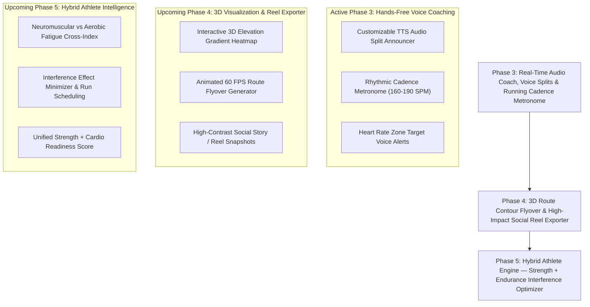

# Thews — Feature Roadmap (Outperforming Strava & Hybrid Training Pro)

This document details the multi-phase technical roadmap for **Thews**, engineered to surpass traditional platforms like Strava by unifying outdoor endurance tracking with pro-level resistance training, hands-free audio coaching, biometric cardiac decoupling, and 3D cinematic route visualization.

---

---

## Active & Upcoming Roadmap Phases

### Phase 3: Real-Time Audio Coach, Voice Splits & Running Cadence Metronome
* **Goal:** 100% hands-free running experience with intelligent audio feedback and cadence optimization.
* **Technical Specifications:**
  * **Customizable Audio Voice Announcer:** Text-to-speech voice splits announced into Bluetooth headphones every km, mile, or custom interval (current pace, split pace, average heart rate, distance remaining).
  * **Rhythmic Audio Cadence Metronome:** Built-in customizable rhythm generator (160–190 SPM) with subtle audio clicks or haptic pulses to train stride rate and reduce knee impact stress.
  * **Heart Rate Zone Audio Boundary Alerts:** Voice prompts when drifting outside target training zone (e.g. *"Exiting Zone 2 — Heart Rate 154 BPM, slow down pace"*).
* **Target Dependencies:** `flutter_tts`, `audioplayers` / native audio synthesizer.
* **Key Target Files:**
  * `lib/core/services/audio_coach_service.dart`
  * `lib/features/running/presentation/widgets/cadence_metronome_sheet.dart`

---

### Phase 4: 3D Route Contour Flyover & High-Impact Social Reel Exporter
* **Goal:** Visual superiority over Strava and Relive by generating stunning 3D elevation maps and animated video route reels.
* **Technical Specifications:**
  * **Interactive Elevation Gradient Heatmap:** Multi-color dynamic polyline on map reflecting gradient steepness (🟢 Flat $\to$ 🟡 Rolling $\to$ 🔴 Steep incline).
  * **Animated 60 FPS Route Flyover:** Render smoothed 3D route fly-through with moving athlete marker, dynamic pace graphs, and split achievement callouts.
  * **Pro Social Share Cards:** Exportable vertical 9:16 and square 1:1 image/video cards formatted for Instagram Stories, TikTok, and Strava with map snapshot, elevation profile, and biometrics.
* **Target Dependencies:** `flutter_map`, `screenshot`, `path_provider`, `share_plus`.
* **Key Target Files:**
  * `lib/features/running/presentation/widgets/gradient_route_painter.dart`
  * `lib/features/running/presentation/widgets/animated_run_flyover_view.dart`
  * `lib/features/running/presentation/widgets/pro_run_share_card.dart`

---

### Phase 5: Hybrid Athlete Engine — Strength + Endurance Interference Optimizer
* **Goal:** The ultimate competitive edge — the first app designed specifically for hybrid athletes who both lift heavy and run hard.
* **Technical Specifications:**
  * **Neuromuscular vs Aerobic Fatigue Matrix:** Unified dashboard combining weight room tonnage (squats, deadlifts) with running mileage and elevation.
  * **Interference Effect Minimizer:** Algorithmic schedule advisor optimizing the temporal spacing between heavy lower-body hypertrophy workouts and high-intensity running intervals to prevent mTOR/AMPK cellular signaling interference.
  * **Unified Athlete Readiness Score:** Comprehensive recovery score blending strength fatigue, running volume, sleep, and resting heart rate.
* **Target Dependencies:** `drift`, `riverpod`, `fl_chart`.
* **Key Target Files:**
  * `lib/features/hybrid/domain/interference_optimizer.dart`
  * `lib/features/hybrid/presentation/hybrid_dashboard_card.dart`
  * `lib/features/hybrid/domain/unified_athlete_readiness_engine.dart`

---

## Future Horizons & Long-Term Backlog

### Future Phase: Community, Async Challenges & Social Live Gym Battles
* **Status:** Saved for Future Exploration
* **Goal:** Connected fitness community with live ghost athlete running race overlays, synchronized gym rest timer battle lobbies, and community-verified routine marketplace.
* **Technical Specifications:**
  * **Ghost Athlete Race Overlay:** Render real-time ghost avatar on GPS run map representing a friend's past run or personal PR pacing.
  * **Live Gym Battle Rest Timer Lobbies:** Real-time WebRTC / WebSocket room synchronizing workout timers and live set counts among training partners.
  * **Verified Coach Routine Marketplace:** Share, rate, and fork structured workout routines with verified cryptographic 1RM proof cards.
* **Target Dependencies:** `web_socket_channel`, `qr_flutter`, `share_plus`.
* **Key Target Files:**
  * `lib/features/community/presentation/live_battle_lobby_screen.dart`
  * `lib/features/community/presentation/routine_marketplace_screen.dart`
  * `lib/features/community/domain/ghost_athlete_engine.dart`
