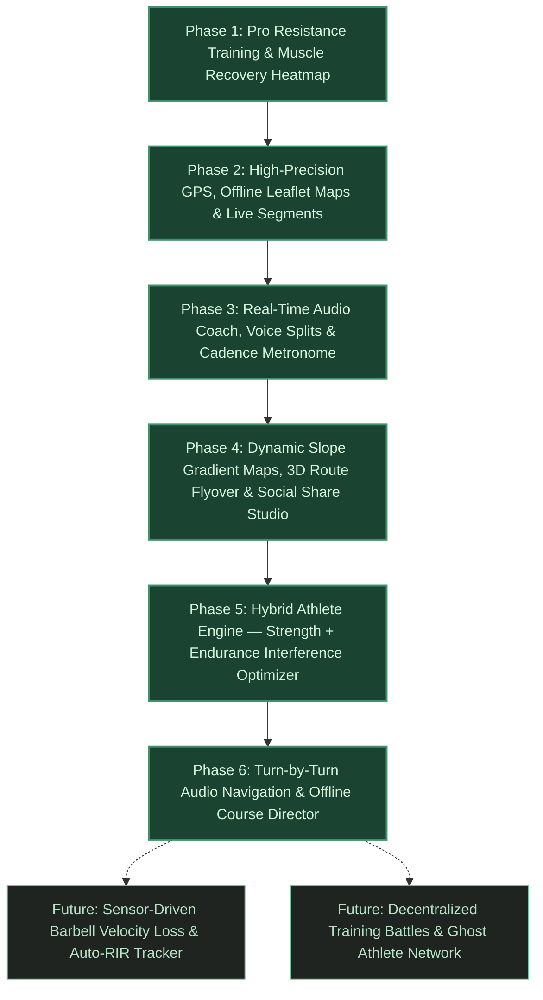

# Thews — Technical Feature Roadmap (Outperforming Strava & Hybrid Training Pro)

This document outlines the architectural roadmap for **Thews**, engineered to surpass single-discipline platforms like Strava and Hevy by unifying outdoor endurance tracking with pro-level resistance training, hands-free audio coaching, cardiac decoupling analytics, and biochemical interference modeling for hybrid athletes.

---

---

## 🚀 Completed Phases

### ✅ Phase 1: Pro-Grade Resistance Training & Muscle Recovery Engine
* **Goal:** High-efficiency strength training logging with localized muscle fatigue visualization and automated overload calculation.
* **Delivered Specifications:**
  * [x] **Active Workout Session Manager:** Real-time set logging with Normal, Warmup, Drop, and Failure set types, automatic rest countdown timers with audio alerts, and plate calculator.
  * [x] **Interactive SVG Muscle Visualization:** Front and back anatomical body maps calculating real-time localized muscle recovery based on 48h–72h physiological decay curves.
  * [x] **AI Progressive Overload Engine:** Dynamic weight, rep, and deload recommendations based on rolling RPE, set volume, and 1RM history.
  * [x] **Local-First SQLite Database:** Zero-latency persistence with Drift ORM, custom routine creation, and PR tracking.
* **Core Files:**
  * `lib/features/workouts/presentation/active_session_screen.dart`
  * `lib/features/workouts/presentation/muscle_visualization_screen.dart`
  * `lib/features/ai_coach/domain/progressive_overload_engine.dart`
  * `lib/features/ai_coach/domain/recovery_fatigue_calculator.dart`
  * `lib/core/database/app_database.dart`

---

### ✅ Phase 2: High-Precision GPS, Offline Vector Maps & Live Segments
* **Goal:** Strava-grade outdoor endurance tracking with offline disk-cached maps and live ghost racing.
* **Delivered Specifications:**
  * [x] **Offline-First Leaflet Map Rendering:** CartoDB Dark/Light vector tiles cached to disk via `PersistentDiskTileProvider` with zero network overhead in offline or test runtimes.
  * [x] **Live Strava-Style Segments:** Automatic proximity detection, dynamic start/finish crossing triggers, real-time time-ahead/behind delta HUD, and ghost avatar position rendering.
  * [x] **Interactive Segment Builder:** In-app route snip tool enabling athletes to create custom Live Segments directly from completed GPS activities.
  * [x] **Territory Heatmap Explorer:** Fullscreen vector route heatmap with date horizon and sport filtering.
  * [x] **Advanced Biometric Telemetry:** Keytel calorie expenditure calculation, Heart Rate Zone distribution, Grade Adjusted Pace (GAP), TRIMP cardiac load, and Aerobic Decoupling ($Pw:HR$) calculations.
* **Core Files:**
  * `lib/features/running/presentation/run_tracker_screen.dart`
  * `lib/features/running/presentation/widgets/leaflet_route_map.dart`
  * `lib/features/running/domain/live_segment_engine.dart`
  * `lib/features/running/presentation/run_heatmap_screen.dart`
  * `lib/features/running/domain/aerobic_decoupling_engine.dart`
  * `lib/features/running/domain/trimp_workload_calculator.dart`

---

### ✅ Phase 3: Real-Time Audio Coach, Voice Splits & Running Cadence Metronome
* **Goal:** 100% hands-free running experience with intelligent voice coaching and ultra-low latency cadence synchronization.
* **Delivered Specifications:**
  * [x] **Text-to-Speech Audio Split Announcer:** Customizable interval voice announcer (pace, split pace, average HR, distance remaining) with multi-language and voice tuning.
  * [x] **Low-Latency Cadence Metronome:** Built-in rhythm generator (120–220 SPM) utilizing a 4-player round-robin pool with `SoundPool` / `AVAudioSession` low-latency modes, audio focus ducking, and dual-layer PCM byte synthesis fallbacks.
  * [x] **Heart Rate Zone Audio Boundary Alerts:** Voice prompts when drifting outside target training zones with debounce cooldown timers.
  * [x] **Quick-Access Toolbar & Bottom Sheets:** Instant modal adjustments for metronome BPM, subdivisions, feedback mode, and voice metrics directly from the active run HUD.
* **Core Files:**
  * `lib/core/services/audio_coach_service.dart`
  * `lib/core/services/cadence_metronome_service.dart`
  * `lib/features/running/presentation/widgets/audio_coach_settings_sheet.dart`
  * `lib/features/running/presentation/widgets/cadence_metronome_sheet.dart`

---

### ✅ Phase 4: Dynamic Slope Gradient Maps, 3D Route Flyover & Social Share Studio
* **Goal:** Elevate post-workout visual analysis above Strava and Relive by generating dynamic slope gradient maps, animated route replays, and pro-grade social story cards.
* **Delivered Specifications:**
  * [x] **Dynamic Slope Gradient Polyline Painter:** Instantaneous slope calculation ($\Delta \text{ele} / \Delta \text{dist} \times 100$) with Gaussian elevation smoothing and color bands (🔵 Downhill $< -3\%$, 🟢 Flat $\pm 3\%$, 🟡 Roll $4-7\%$, 🔴 Climb $8\%+$) with interactive map toggle and floating legend chip.
  * [x] **Animated 60 FPS Route Flyover Screen:** Cinematic camera flight simulator along GPX path with moving 3D athlete beacon, live telemetry HUD (Distance, Current Pace, Altitude, Elevation Gain), interactive scrub slider, $1\times/2\times/4\times/8\times$ multipliers, and milestone split toasts.
  * [x] **Social Share Studio with Route-Only Overlay:** Multi-aspect ratio card generator (9:16 Story, 1:1 Square, 16:9 Landscape) with presets (*Volt Dark*, *Terrain Gradient*, *Pace Zones*, *Route-Only Overlay* with optional transparent canvas for Instagram/TikTok photo stickers).
* **Core Files:**
  * `lib/features/running/presentation/widgets/gradient_route_painter.dart`
  * `lib/features/running/presentation/animated_route_flyover_screen.dart`
  * `lib/features/running/presentation/widgets/run_share_card.dart`
  * `lib/features/running/presentation/run_summary_screen.dart`
  * `lib/features/running/presentation/run_history_screen.dart`

---

### ✅ Phase 5: Hybrid Athlete Engine — Strength + Endurance Interference Optimizer (COMPLETED)
* **Goal:** The ultimate competitive edge — the first app engineered specifically for hybrid athletes who lift heavy and run hard.
* **Delivered Specifications:**
  * [x] **Unified Hybrid Athlete Dashboard Card:** Integrated right on the main dashboard screen, cross-indexing lower body resistance tonnage (Squats, Deadlifts, Leg Press, Lunges) against outdoor running mileage, pace, and elevation gain over the last 7 to 28 days.
  * [x] **mTOR vs. AMPK Biochemical Interference Advisor:** Algorithmic schedule analyzer detecting cellular signaling conflicts between heavy hypertrophy lifting and high-intensity aerobic intervals, calculating remaining clearance windows and recommending optimal workout temporal spacing.
  * [x] **Unified Athlete Readiness Engine (0–100):** Multi-system recovery algorithm uniting localized neuromuscular fatigue decay (48h–72h half-life), running TRIMP cardiovascular strain, acute-to-chronic workload ratios (ACWR), and interference penalty points.
  * [x] **Interactive Biomechanics Modal Sheet:** Tap-to-expand deep-dive explaining molecular signaling cascades, neuromuscular fatigue bars, cardiovascular strain gauge, and prescriptive daily training focus.
* **Core Files:**
  * `lib/features/hybrid/domain/interference_optimizer.dart`
  * `lib/features/hybrid/domain/unified_readiness_engine.dart`
  * `lib/features/hybrid/presentation/hybrid_readiness_provider.dart`
  * `lib/features/hybrid/presentation/hybrid_readiness_dashboard_card.dart`
  * `lib/features/workouts/presentation/dashboard_screen.dart`

---

### ✅ Phase 6: Turn-by-Turn Audio Navigation & Offline Course Director (COMPLETED)
* **Goal:** Guided outdoor exploration without looking at the screen.
* **Delivered Specifications:**
  * [x] **Offline Turn Cue Generator:** Extract bearing deflection angle turn cues (sharp left/right, turn left/right, slight left/right, u-turn, roundabout, start/finish) with adaptive geometry smoothing.
  * [x] **Proximity Voice Direction Engine:** High-precision audio cues delivered via Text-to-Speech: advance warnings (35–55m), immediate turn execution cues (8–16m), and destination arrival announcements.
  * [x] **Cross-Track Distance & Course Deviation Warnings:** Perpendicular segment projection algorithm calculating real-time off-course distance with >25m alerts and <15m back-on-track recovery cues.
  * [x] **Course Director & GPX Import/Export Suite:** In-app Course Director with curated loops (5K Waterfront, 10K City Perimeter, 1.6K Mile Sprint), direct GPX file import from device storage, GPX 1.1 XML track exports, and one-tap conversion of recorded runs into reusable courses.
  * [x] **Turn-by-Turn Floating HUD & Map Route Layer:** High-contrast floating navigation HUD with dynamic turn icon, distance gauge, course progress indicator, and glowing neon-cyan course guide polyline on Leaflet map.
* **Core Files:**
  * `lib/core/services/turn_navigation_service.dart`
  * `lib/core/services/course_storage_service.dart`
  * `lib/features/running/domain/gpx_course_navigator.dart`
  * `lib/features/running/presentation/widgets/turn_direction_hud.dart`
  * `lib/features/running/presentation/widgets/course_director_sheet.dart`
  * `lib/features/running/presentation/widgets/leaflet_route_map.dart`
  * `lib/features/running/presentation/run_tracker_screen.dart`
  * `lib/features/running/presentation/run_summary_screen.dart`

---

## 🌐 Future Horizons & Long-Term Ecosystem (Future Scope)

### 🔮 Phase 7: Sensor-Driven Barbell Velocity Loss & Auto-RIR Tracker
* **Status:** Future Scope
* **Goal:** Machine-assisted strength calibration to optimize lifting intensity without manual RPE guesswork.
* **Technical Specifications:**
  * [ ] **Accelerometer-Based Velocity Tracking:** Detect concentric lifting velocity and percentage velocity loss across reps within a set.
  * [ ] **Automated Reps in Reserve (RIR) Estimation:** Predict proximity to failure ($RIR$) from the velocity drop-off curve between early and late set repetitions.
  * [ ] **1RM Auto-Adjustment:** Dynamically update estimated 1RM when set velocity indicates superior neuromuscular freshness.
* **Target Dependencies:** `sensors_plus`.
* **Target Files:**
  * `lib/features/workouts/domain/barbell_velocity_engine.dart`
  * `lib/features/workouts/presentation/widgets/velocity_tracker_sheet.dart`

---

### 🔮 Phase 8: Decentralized Training Battles, Ghost Pacing & Coach Marketplace
* **Status:** Future Scope
* **Goal:** Community-driven hybrid training with synchronized live lobbies, ghost pacing networks, and verifiable routine sharing.
* **Technical Specifications:**
  * [ ] **Live Rest-Timer Gym Battle Lobbies:** Real-time WebRTC / WebSocket rooms synchronizing rest countdowns and set completions among training partners.
  * [ ] **Ghost Athlete Network:** Download and race against friend or community GPX efforts with real-time HUD delta markers.
  * [ ] **Verified Coach Routine Marketplace:** Share, rate, and fork structured workout routines with verified cryptographic 1RM proof cards.
* **Target Dependencies:** `web_socket_channel`, `qr_flutter`, `share_plus`.
* **Target Files:**
  * `lib/features/community/presentation/live_battle_lobby_screen.dart`
  * `lib/features/community/presentation/routine_marketplace_screen.dart`
  * `lib/features/community/domain/ghost_athlete_engine.dart`
